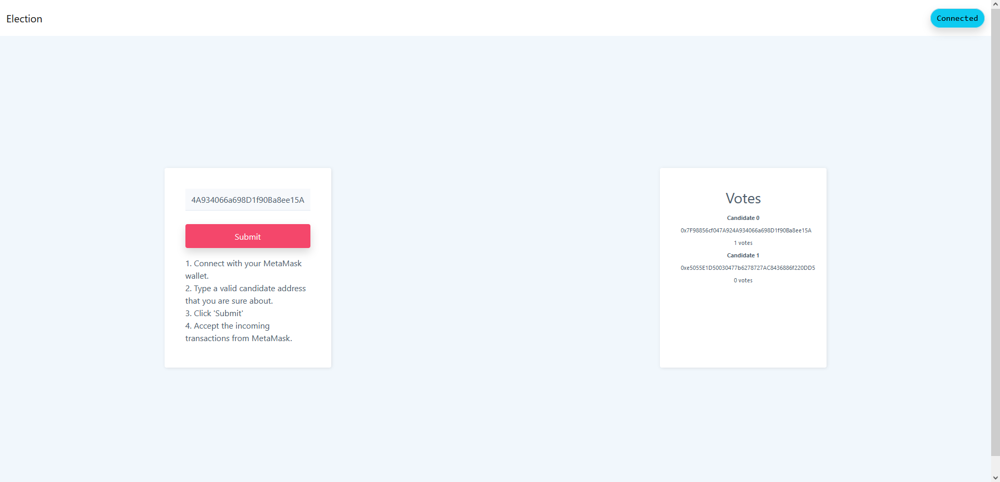

# election-erc20
A decentralized application for elections using the ERC20 token protocol.<br>This is currently a project in development.

## Table of contents
  - [Preview](#preview)
  - [Requirements](#requirements)
  - [Testing the contracts](#testing-the-contracts)
  - [Setup](#setup)
  - [To-do](#to-do)
  - [Credits](#credits)
  - [Contribution](#contribution)

## Preview
<br>
**Note:** The front-end was designed by me using Bootstrap Studio. 
If you think you can design a better, nicer front-end, feel free to open a pull request.

## Requirements
- Python 3.6 or greater
- pip
- NodeJS and npm
- yarn
    * `npm install yarn`
- ganache-cli
    * `npm install ganache-cli`
- brownie
    * `pip install eth-brownie`

## Testing the contracts
```python
brownie run scripts/deploy.py # Local deployment
brownie test -W ignore::DeprecationWarning # Unit testing
```

## Setup
At the frontend folder;
```python
yarn # Installs dependencies
yarn build # Bundles the JavaScript
yarn http-server # Runs the server
```
If you changed any JS code in index.js and want to bundle it, you can run `yarn build` any time.

Steps to set the front-end up (for now, locally)
- Run **launch_and_deploy.bat** with your pre-saved [mnemonic](#ganachemetamask-tip) (for Windows)
    * Or if you want to do it manually, follow these steps
      + Launch Ganache: `ganache-cli`
      + Deploy contracts (in base folder): `brownie run scripts/deploy.py`
      + Start election (in base folder): `brownie run scripts/start_election.py`
- [Import Ganache account into MetaMask](https://metamask.zendesk.com/hc/en-us/articles/360015489331-How-to-import-an-Account)
    * You should get the private key from ganache-cli, choose one of the private keys after the second one (0 = admin, 1 and 2 = candidates)
    * Make sure you are in the network 'Localhost 8545' in MetaMask
- Launch local host (in folder: frontend): `yarn http-server`
    * after 'Available on:', the second link is the right link
- Connect your wallet from the front-end
- Get a candidate's address from ganache-cli
    * Choose either address 1 or address 2 because these are the candidates (0 = admin, others are voters)
- Follow the inputs in the front-end and see the responses in the console

#### Ganache/MetaMask tip:
If you do not want to import ganache keys into MetaMask every time you launch a new one,<br>
you can launch a single consistent ganache instance using the mnemonic with this command: 
 * `ganache-cli -d -m 'your_mnemonic'`

If you want to use this, make sure that you store your initial mnemonic somewhere.<br>
**Note that you will still have to deploy at every new launch!**

## To-do
- Front-end
   * Homepage design ✔️
   * Integration with brownie ✔️
   * Info on homepage ✔️
   * Post-election info on homepage ✔️
- Implementing election start-end mechanism ✔️
- Deployment onto Kovan testnet

## Credits
Thanks to [@PatrickAlphaC](https://github.com/PatrickAlphaC) for providing with the [MetaMask connection codebase](https://github.com/PatrickAlphaC/html-js-ethers-connect/).

## Contribution
You can open a pull request or issue at any point you think you can add a feature or you have found a mistake/error.
